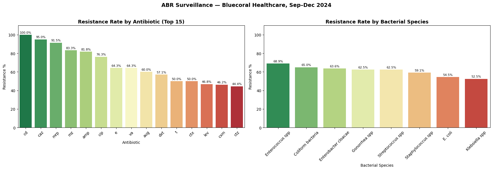

# ABR Surveillance Data Pipeline
**End-to-end data pipeline for antibiotic resistance surveillance**

Built by [Grace Eso](wwww.linkedin.com/in/grace-eso-094a61131) — Medical Laboratory Scientist & Healthcare Data Scientist

---

## Overview
Transforms raw microbiology laboratory records into structured, 
analysis-ready data with automated resistance rate calculations.

Built from real clinical data collected at Bluecoral Healthcare 
Services Ltd (Sep–Dec 2024). Data anonymized — no patient 
identifiers included.

## Pipeline Stages
| Step | What it does |
|------|-------------|
| 1. Ingest | Loads raw CSV, validates structure and completeness |
| 2. Clean | Standardizes species names, antibiotic codes, demographics |
| 3. Transform | Explodes antibiotic lists to long format, calculates resistance rates |
| 4. Visualize | Generates resistance charts for clinical reporting |

## Key Findings (Sep–Dec 2024)
- 58 culture-positive cases across 8 bacterial species groups
- **Overall resistance rate: ~60%** across all isolates and antibiotics
- **Clindamycin and Ceftazidime** showed highest resistance (100% and 95%)
- **Enterococcus spp** was the most resistant organism (68.9%)
- **Levofloxacin and Co-trimoxazole** showed relatively lower resistance

## Dataset
- 58 culture-positive cases over 4 months
- 8 bacterial species groups after standardization
- 20+ antibiotics tested
- Sample types: Urine, HVS, Semen, Blood, Sputum, Swabs

## Tech Stack
Python · Pandas · Matplotlib · Seaborn · Google Colab

## Clinical Relevance
Demonstrates how routine lab bookkeeping data can be transformed 
into actionable surveillance insights — no expensive infrastructure 
required. Designed with sustainability in mind for resource-limited 
healthcare settings.

---
*This project is part of a broader research interest in AI and 
data-driven methods for healthcare decision support in 
low-resource environments.*
